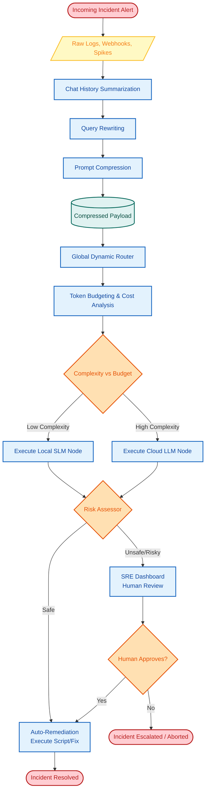

# Incident Execution Flow

This document details the step-by-step flowchart of an incident moving through the Token-Aware Multi-Agent Architecture.

## Flow Diagram

```mermaid
flowchart TD
    %% Node Definitions with Standard Flowchart Shapes
    Start([Incoming Incident Alert])
    InputData[/Raw Logs, Webhooks, Spikes/]
    
    %% Phase 1
    P1A[Chat History Summarization]
    P1B[Query Rewriting]
    P1E[Prompt Compression]
    CompressedData[(Compressed Payload)]
    
    %% Phase 2
    RouterProcess[Global Dynamic Router]
    Budget[Token Budgeting & Cost Analysis]
    RouteDecision{Complexity vs Budget}
    
    %% Phase 3
    LocalNode[Execute Local SLM Node]
    CloudNode[Execute Cloud LLM Node]
    
    %% Action Layer
    RiskAssessment{Risk Assessor}
    AutoFix[Auto-Remediation<br/>Execute Script/Fix]
    HumanReview[SRE Dashboard<br/>Human Review]
    HumanDecision{Human Approves?}
    Resolved([Incident Resolved])
    EndAbort([Incident Escalated / Aborted])

    %% Flow Connections
    Start --> InputData
    InputData --> P1A
    P1A --> P1B
    P1B --> P1E
    P1E --> CompressedData
    
    CompressedData --> RouterProcess
    RouterProcess --> Budget
    Budget --> RouteDecision
    
    RouteDecision -- "Low Complexity" --> LocalNode
    RouteDecision -- "High Complexity" --> CloudNode
    
    LocalNode --> RiskAssessment
    CloudNode --> RiskAssessment
    
    RiskAssessment -- "Safe" --> AutoFix
    RiskAssessment -- "Unsafe/Risky" --> HumanReview
    
    HumanReview --> HumanDecision
    HumanDecision -- "Yes" --> AutoFix
    HumanDecision -- "No" --> EndAbort
    
    AutoFix --> Resolved

    %% Styling
    classDef startend fill:#ffcdd2,stroke:#b71c1c,stroke-width:2px,color:#b71c1c
    classDef inputdata fill:#fff9c4,stroke:#fbc02d,stroke-width:2px,color:#f57f17
    classDef process fill:#e3f2fd,stroke:#1565c0,stroke-width:2px,color:#0d47a1
    classDef database fill:#e0f2f1,stroke:#00695c,stroke-width:2px,color:#004d40
    classDef decision fill:#ffe0b2,stroke:#e65100,stroke-width:2px,color:#e65100
    
    class Start,Resolved,EndAbort startend;
    class InputData inputdata;
    class P1A,P1B,P1E,RouterProcess,Budget,LocalNode,CloudNode,AutoFix,HumanReview process;
    class CompressedData database;
    class RouteDecision,RiskAssessment,HumanDecision decision;
```
